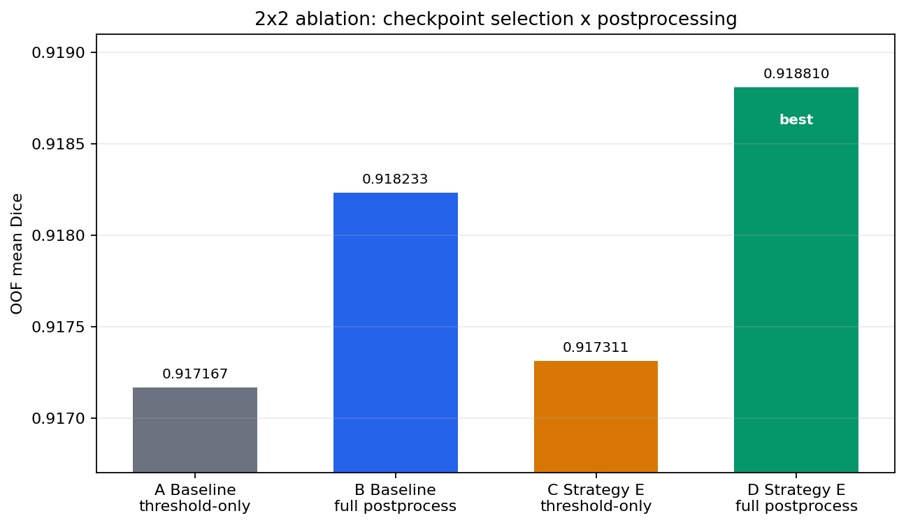
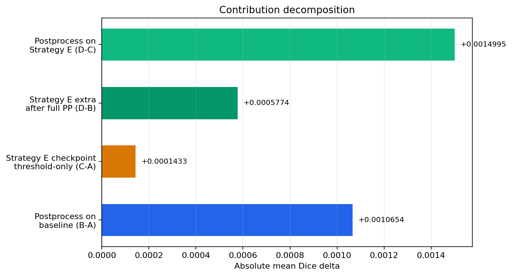
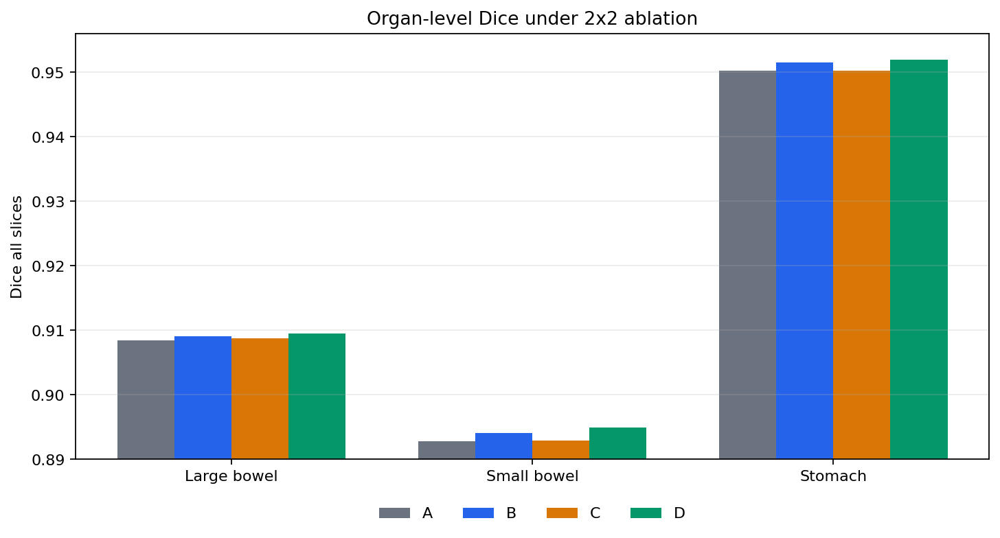
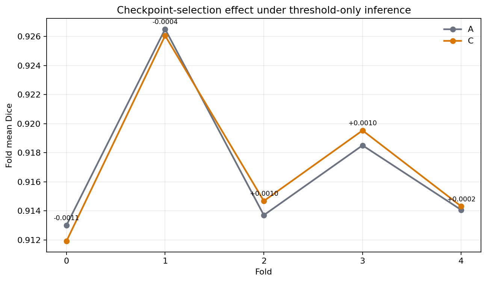
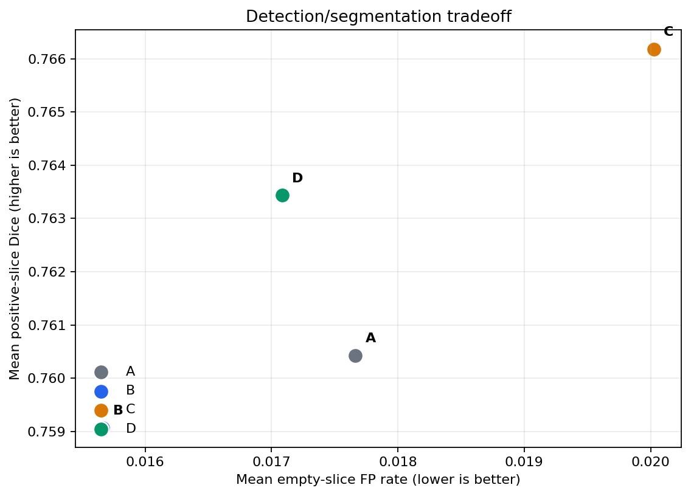

# Baseline 与 Strategy E 消融实验报告

生成时间：2026-06-24

## 摘要

本报告基于坐标修正后的 5-fold OOF 实验，重新构建 baseline 与 Strategy E 的消融对照。核心问题不是单纯比较两个最终分数，而是拆开两个因素：

1. checkpoint 选择：普通 Stage1 `best.pt` vs postprocess-aware 的 `best_postprocess.pt`。
2. 推理后处理：threshold-only vs full postprocess，包括 classification gate、min-area、z-continuity 与 3D component cleanup。

最终 2x2 消融显示，完整 Strategy E 达到 OOF mean Dice `0.9188102194`，优于完整 baseline postprocess 的 `0.9182328103`，绝对提升 `+0.0005774091`。相对纯 Stage1 threshold baseline 的 `0.9171674286`，完整 Strategy E 提升 `+0.0016427907`。

## 实验设计

所有实验均使用 maskfix 后的数据解释逻辑，避免早期 RLE/图像尺寸坐标错误影响结论。评估口径统一为本地 5-fold OOF，指标包括 all-slice Dice、positive-slice Dice 与 empty-slice false positive rate。

| 组别 | Checkpoint 来源 | 推理后处理 | 主要产物 |
| --- | --- | --- | --- |
| A | baseline `best.pt` | threshold + cls gate | `outputs/maskfix_stage1_baseline_oof/h200_stage1_eval_config_component_postprocess.json` |
| B | baseline `best.pt` | threshold + cls gate + min-area/z/component search | `outputs/ablation_oof/baseline_full_component_search.json` |
| C | Strategy E `best_postprocess.pt` | threshold + cls gate | `outputs/ablation_oof/strategy_e_threshold_only_eval.json` |
| D | Strategy E `best_postprocess.pt` | threshold + cls gate + min-area/z/component search | `outputs/maskfix_oof/h200_stage1_component_parallel_search.json` |

baseline full postprocess 使用分 fold worker 完成，避免一次性 OOF 缓存导致显存/内存压力。搜索空间为 `min_area={0,48,96,192}`、`z_min_run={1,2,3}`、`min_volume={0,64,128,256,512}`、`keep_largest={False,True}`、`connectivity=1`。Strategy E full postprocess 使用同一类组件搜索框架与其自身 threshold/cls gate 结果。

## 总体结果

| 组别 | Mean Dice | Positive Dice | Empty FP Rate |
| --- | ---: | ---: | ---: |
| A baseline threshold-only | 0.9171674286 | 0.7604206698 | 0.0176627033 |
| B baseline full postprocess | 0.9182328103 | 0.7590589354 | 0.0156666431 |
| C Strategy E threshold-only | 0.9173107277 | 0.7661876745 | 0.0200250175 |
| D Strategy E full postprocess | 0.9188102194 | 0.7634351159 | 0.0170830851 |

这组结果支持两个判断。第一，后处理本身有效：baseline 从 A 到 B 提升 `+0.0010653816`。第二，Strategy E 不只是“用了后处理才好”，在完整后处理口径下 D 仍比 B 高 `+0.0005774091`，说明 postprocess-aware checkpoint selection 对最终 pipeline 还有额外贡献。

| 对比 | 含义 | Mean Dice 变化 |
| --- | --- | ---: |
| B - A | baseline checkpoint 上加入 full postprocess | +0.0010653816 |
| C - A | threshold-only 下替换为 Strategy E checkpoint | +0.0001432991 |
| D - B | full postprocess 下替换为 Strategy E pipeline | +0.0005774091 |
| D - C | Strategy E checkpoint 上加入 full postprocess | +0.0014994916 |

## 器官级消融

| Organ | A baseline threshold | B baseline full | C Strategy E threshold | D Strategy E full | D - B |
| --- | ---: | ---: | ---: | ---: | ---: |
| large_bowel | 0.9084450907 | 0.9091382230 | 0.9087730441 | 0.9094941408 | +0.0003559178 |
| small_bowel | 0.8928155890 | 0.8940829999 | 0.8928821776 | 0.8949580038 | +0.0008750039 |
| stomach | 0.9502416062 | 0.9514772079 | 0.9502769615 | 0.9519785134 | +0.0005013055 |

small bowel 是完整 Strategy E 相对完整 baseline 提升最大的类别。这个现象符合任务结构：small bowel 阳性区域更碎，跨切片连续性更弱，对 cls gate、z-continuity 和组件过滤更敏感。

## Checkpoint 选择效果

为了隔离 checkpoint 选择，不引入 full postprocess 的候选搜索变量，fold 配对图只比较 A 与 C，也就是同为 threshold-only 的 baseline checkpoint 和 Strategy E checkpoint。

| Fold | A baseline threshold | C Strategy E threshold | C - A |
| --- | ---: | ---: | ---: |
| 0 | 0.9130052369 | 0.9119157682 | -0.0010894687 |
| 1 | 0.9265100780 | 0.9260615570 | -0.0004485210 |
| 2 | 0.9137103216 | 0.9146843601 | +0.0009740384 |
| 3 | 0.9185112186 | 0.9195375154 | +0.0010262968 |
| 4 | 0.9140686969 | 0.9143138731 | +0.0002451762 |

checkpoint-only 的平均增益较小，仅 `+0.0001432991`，并且 fold0、fold1 为负。这说明 Strategy E 的主要价值不应被解释为“单独选点就显著提升 raw Dice”。更严谨的解释是：postprocess-aware checkpoint 与最终后处理共同工作，使完整 pipeline 在 OOF 聚合指标上更优。

## Positive Dice 与空切片误报权衡

baseline full postprocess 的优势是空切片误报率最低，从 A 的 `0.0176627033` 降到 B 的 `0.0156666431`，但 positive Dice 从 `0.7604206698` 降到 `0.7590589354`。这说明该分支更偏保守，会过滤掉一部分真实阳性弱响应。

Strategy E threshold-only 的 positive Dice 最高，为 `0.7661876745`，但空切片误报率也最高，为 `0.0200250175`。完整 Strategy E 将两者折中到更均衡的位置：positive Dice `0.7634351159`，empty FP rate `0.0170830851`，同时 mean Dice 达到最高 `0.9188102194`。

## 最终后处理参数

| Pipeline | Organ | Mask Thr | Cls Thr | Min Area | Z Min Run | Min Volume | Keep Largest |
| --- | --- | ---: | ---: | ---: | ---: | ---: | --- |
| baseline full | large_bowel | 0.25 | 0.70 | 48 | 2 | 512 | False |
| baseline full | small_bowel | 0.25 | 0.70 | 48 | 3 | 512 | False |
| baseline full | stomach | 0.25 | 0.20 | 96 | 3 | 512 | False |
| Strategy E full | large_bowel | 0.25 | 0.70 | 48 | 2 | 512 | False |
| Strategy E full | small_bowel | 0.25 | 0.80 | 48 | 3 | 512 | False |
| Strategy E full | stomach | 0.25 | 0.20 | 48 | 1 | 0 | True |

两条 pipeline 对 large bowel 的后处理选择一致，对 small bowel 的主要差异是 Strategy E 选择了更高的 cls gate `0.80`。stomach 差异更明显：baseline 倾向强过滤，Strategy E 倾向保留最大连通结构。这与 D 相比 B 的器官级提升一致，尤其是 stomach 的 `+0.0005013055`。

## 严谨性说明

这版实验比旧版更严格，原因如下：

1. baseline 不再只用 threshold-only fallback，而是补跑了 full postprocess component search。
2. checkpoint 选择和后处理被拆成 2x2 结构，能区分“后处理有效”和“Strategy E checkpoint selection 有额外贡献”。
3. 所有结果来自相同 maskfix 数据、相同 5-fold OOF 评估口径，并保留 positive Dice 与空切片误报率，避免只看单一 mean Dice。

仍需注意两个限制。第一，baseline full 与 Strategy E full 的后处理参数分别在各自 checkpoint 上搜索，因此这是 pipeline-level ablation，不是固定后处理参数下的纯 checkpoint ablation。第二，提升幅度是千分位量级，适合表述为稳定的小幅增益，不应夸大为架构性跃迁。

## 结论

当前实验能够支持 Strategy E 的有效性，但结论应精确表述为：在坐标修正后的 UWGI 5-fold OOF 设置中，Strategy E 完整 pipeline 比完整 baseline pipeline 更优，OOF mean Dice 从 `0.9182328103` 提升到 `0.9188102194`，并在三个器官上均有正向增益。

如果只看 checkpoint selection，Strategy E 的独立增益较小且 fold 间不完全一致；如果只看后处理，baseline 也能获得主要收益。因此最稳妥的结论是：框架有效性来自 postprocess-aware checkpoint selection 与解剖连续性后处理的组合，其中后处理贡献最大，Strategy E 进一步改善了完整 pipeline 的上限与器官级一致性。
